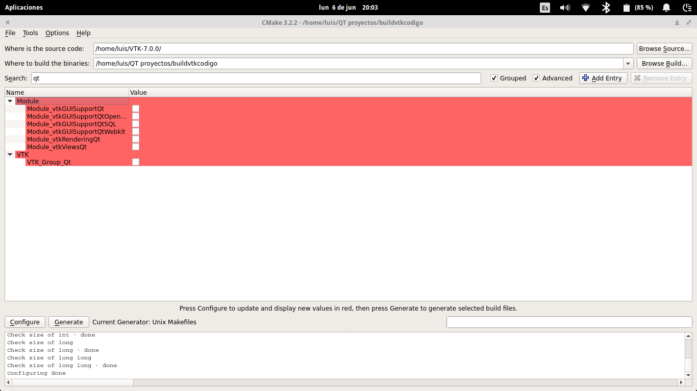

## easyGraph - A Grapher equations
Grapher equations in C++ with Qt library.

***

Members
------------------------
* **Jair Francesco Huaman Canqui.**
* **Luis Antonio Bernal Chahuayo.**
* **Aldo Alexis Mendoza villarroel.**

Computer Science - Universidad Nacional San Agustín - Arequipa, Peru

***
##Requisitos
Para compilar EasyGraph, necesitarás:
* VTK 7
* CMAKE 3
* QT 5.6

##Instrucciones instalación requisitos
1. Instalar CMake 3
	```
	sudo apt-get install software-properties-common
	sudo add-apt-repository ppa:george-edison55/cmake-3.x
	sudo apt-get update
	```
	When cmake is not yet installed:
	```
	sudo apt-get install cmake
	```
	
	When cmake is already installed:
	```
	sudo apt-get upgrade
	```	
	Fuente: [AskUbuntu.com](http://askubuntu.com/questions/610291/how-to-install-cmake-3-2-on-ubuntu-14-04)
	
2. Instalar CMake GUI
	Por comodidad usaremos CMake GUI:
	```
	sudo apt-get install cmake-curses-gui
	```
	Fuente: [AskUbuntu.com](http://askubuntu.com/questions/121797/how-do-i-install-ccmake)
	
3. Compilar e Instalar VTK
	* Primero debemos descargar VTK 7 desde la [página oficial](http://www.vtk.org/download/).
	* Abrimos CMake GUI 
	```
	cmake-gui
	```
	???
	* Seleccionamos la carpeta donde esta el codigo fuente de VTK, y la carpeta de destino
	* Consideramos que tienes instalado QT 5.6
	* Search: qt ; y seleccionamos los modulos QT y VTK_Group_QT (Hacerles Check)
	
	* Configure
	* Vamos a la carpeta donde se generaron los archivos de compilación; comprobaremos que se ha creado un Makefile
	* Compilamos (-j4; para compilar en 4 hebras: Depende del numero de procesadores)
	```
	make -j4
	```
	* Instalamos VTK
	```
	sudo make install
	```

## Getting Involved

Want to report a bug, request a feature, contribute to easyGraph? Check out our in-depth guide to [Contributing to easyGraph](CONTRIBUTING.md#contributing-to-easyGraph). We need all the help we can get! You can also join our [community](README.md#community) to keep up-to-date and meet other developers.

## Getting Started

If you're comfortable getting up and running from a `git clone`, this method is for you.

The [master](https://github.com/JairFrancesco/easyGraph) branch which contains the latest release.

#### Quickstart:

	##### Under Construction

If you encounter trouble with the above method, you can try:

	##### Under Construction

Optionally, you may simply run `.sh` if you are on a linux or mac based operating system.

<a name="community"></a>
## Community

Keep track of easyGraph development and community activity.

* Follow easyGraph on [Twitter] (), [Facebook] () and [Google+]().
* Read and subscribe to [The Official easyGraph Blog]().
* Join in discussions on the [easyGraph Forum](https://reddit.com/r/easyGraph/)
* Connect with us on IRC at `#easyGraph` on freenode ([web access](http://webchat.freenode.net/?channels=easyGraph))

##Screenshots


## Versioning

For transparency and insight into our release cycle, and for striving to maintain backward compatibility, easyGraph will be maintained according to the [Semantic Versioning](http://semver.org/) guidelines as much as possible.

Releases will be numbered with the following format:

`<major>.<minor>.<patch>-<build>`

Constructed with the following guidelines:

* A new *major* release indicates a large change where backward compatibility is broken.
* A new *minor* release indicates a normal change that maintains backward compatibility.
* A new *patch* release indicates a bugfix or small change which does not affect compatibility.
* A new *build* release indicates this is a pre-release of the version.


## License

[easyGraph](https://github.com/JairFrancesco/easyGraph) is released under [GNU GENERAL PUBLIC LICENSE](https://github.com/JairFrancesco/easyGraph/blob/master/LICENSE) . Copyright (c) [Jair Huaman](https://sites.google.com/site/jafrahuamancanqui/).
